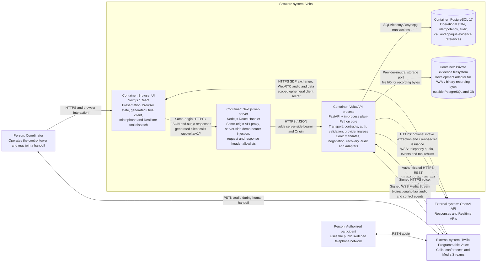

# Volta container architecture

Volta uses one typed Python core for its browser and phone-call paths. This page explains
the runtime containers, transports, external integrations, responsibility boundaries, and
validation status. The C4 container view below includes only relationships present in the
application wiring or provider ingress implemented in this repository.

## C4 container view

The FastAPI transport boundary and the `yuno_backend` core are separate code ownership
boundaries but not separate runtime containers: the API imports and calls the core directly
inside one Python process. The Next.js browser bundle and Node.js proxy are shown separately
because they execute in different runtimes and the bearer credential exists only in the
server runtime.

The relationships are grounded in these code paths:

- The generated client uses the custom [`voltaFetch`](../frontend/src/lib/api/volta-fetch.ts),
  which rewrites browser requests to the same-origin
  [`/api/volta/*` proxy](../frontend/src/app/api/volta/%5B...path%5D/route.ts).
- The [FastAPI application factory](../api/app/main.py) wires the HTTP contracts, Realtime,
  and telephony routers to the in-process core services.
- The [text application wiring](../api/app/volta_text_service.py) creates the PostgreSQL unit
  of work, optional OpenAI intake extractor, and private evidence-storage adapter.
- The [telephony application wiring](../api/app/telephony/service.py) creates the Twilio REST,
  OpenAI server-Realtime, PostgreSQL, and evidence-storage adapters.
- The [browser Realtime client](../frontend/src/features/realtime/browser-realtime.ts) performs
  the OpenAI SDP exchange and carries audio and events over WebRTC.
- The [Twilio media bridge](../api/app/telephony/bridge.py) exchanges bounded audio, control
  events, and tool results between Twilio's WSS stream and OpenAI Realtime.

The repository also contains an unimplemented Yuno gateway seam and Yuno webhook-signature
helper. Neither is wired into the FastAPI application, so Yuno is intentionally absent from
the container view.

## Read the architecture and its evidence status

The diagram describes implemented code paths, not proof that every external path completed
against live providers. Browser application requests use HTTPS and JavaScript Object Notation
(JSON). Browser audio uses Web Real-Time Communication (WebRTC). Twilio uses HTTPS callbacks
and a WebSocket Secure (WSS) media stream.

The evidence labels have these meanings:

- **Demonstrated**: The deterministic browser and text journey passed through the generated client, FastAPI, the core, PostgreSQL, and private audio playback
- **Accepted with waiver**: Browser WebRTC reached OpenAI Realtime, but the model did not complete the required two-tool roundtrip. The team did not perform qualitative voice checks
- **Implemented, not live-proven**: The signed Twilio HTTPS callbacks and WSS media bridge passed deterministic tests. No authorized Twilio sandbox call proved the complete path
- **Final-trial-only**: Three overlapping phone calls, inbound recovery, and live human takeover have no completed validation claim

See the [Phase 17 validation](project-specs/2026-08-30-17-pass-browser-trial/validation.md) for the explicit Realtime waiver. See the [Phase 19 validation](project-specs/2026-08-30-19-bridge-twilio-media/validation.md) for the unchecked Twilio sandbox evidence.

The [Phase 20 validation](project-specs/2026-08-30-20-add-outbound-call-controls/validation.md) separately proves the consent-gated outbound control, generated request, honest four-state projection, and browser/text fallbacks. That credential-free UI evidence placed no call and does not upgrade the Twilio path to live-proven.

## Keep operational authority in the core

FastAPI translates transport-specific input into typed application calls. It does not select carriers, validate mandates, choose a winner, or mutate commitment state. The core owns those decisions for browser text, browser voice, and Twilio media.

The coordinator approves a structured mandate before negotiation starts. Deterministic core rules then enforce eligibility, price, pickup window, conditions, idempotency, and exactly one active commitment. OpenAI and Twilio transport conversation events, but neither provider grants authority or selects the winner.

Human takeover belongs at the FastAPI and core boundary. A future verified action must preserve the remote phone leg. It must also stop further artificial intelligence (AI) commitment tools atomically. Phase 21 does not claim that final-trial outcome.

## Separate browser and provider ingress

The browser uses generated Orval calls over same-origin HTTPS and JSON for application actions. The custom fetch boundary rewrites those calls to the Next.js `/api/volta/*` Route Handler. That server-side proxy accepts only `/v1` paths, injects the demo bearer, and forwards the request to FastAPI. FastAPI’s Pydantic models generate `api/openapi.json`, which generates the TypeScript client under `frontend/src/lib/api/generated/`. Change the Pydantic source first, then run `make generate`; never edit generated files directly.

Browser voice is the narrow provider exception. FastAPI authorizes the request and returns a scoped, short-lived Realtime client secret. The browser keeps it in memory and connects to OpenAI over WebRTC. The standard OpenAI key stays server-side.

Twilio reaches separate provider-ingress routes. FastAPI bounds each form body and verifies signed voice, consent, and terminal-status callbacks before delegation. It also verifies and binds one WSS Media Stream before exchanging bounded audio, events, and tool results with OpenAI Realtime. These provider routes are not browser contracts and do not appear in the generated Orval client.

## Store state and audio on separate boundaries

PostgreSQL stores operations, immutable mandate versions, quotes, commitments, recovery decisions, audit records, evidence metadata, and opaque recording references. Recording bytes never enter PostgreSQL or Git.

The core accesses recording bytes through a provider-neutral private-storage protocol. The local development adapter restricts directories to mode `0700` and files to `0600`; it is not encrypted production storage. A production deployment must replace it before handling real recordings. Authenticated playback returns private, no-store responses without exposing the storage reference.

## Protect credentials and participant data

FastAPI keeps the standard OpenAI key, Twilio credentials, database credentials, signatures, and raw provider payloads away from the browser. Logs and safe errors must exclude authorization values, phone numbers, transcripts, and audio. Twilio callbacks fail closed when signatures, accounts, call bindings, stream bindings, frame limits, or sequence rules do not match.

Volta uses synthetic carriers and operations for the public demo. Private recordings stay outside the repository under explicit access, retention, and deletion controls. Volta does not use Yuno, payments, or payment credentials because the selected Nauta challenge has no payment journey.
