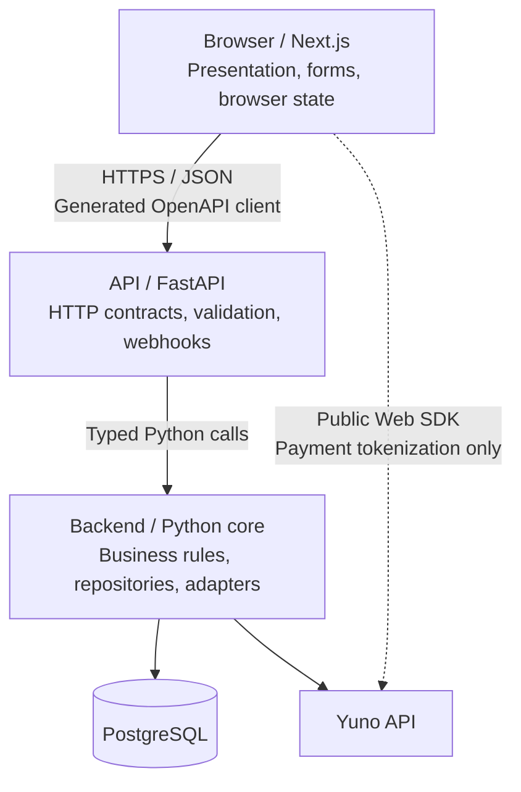

# Understand the application architecture

This repository keeps the browser, Hypertext Transfer Protocol (HTTP) boundary, and business logic in separate modules. FastAPI imports the Python core directly, so the code preserves the boundary without adding a network service.

## Follow a request through the layers

The frontend calls only this repository’s FastAPI application. Yuno’s browser Software Development Kit (SDK) is the sole payment exception, and it handles payment user interface and tokenization with a public key. HTTP responses use JavaScript Object Notation (JSON).



## Keep ownership explicit

Each module owns one type of decision:

- `frontend/` owns rendering, browser state, forms, and user interaction
- `api/` owns Pydantic contracts, validation, Cross-Origin Resource Sharing (CORS), HTTP errors, and webhook ingress
- `backend/` owns domain rules, application services, persistence abstractions, and provider adapters
- `infra/` owns local development support without application logic

The API layer stays thin. It translates HTTP requests into typed application calls and maps results back to HTTP responses. The backend package never imports FastAPI.

## Generate the browser contract

The OpenAPI document is the contract source for TypeScript. The generation flow is:

```text
Pydantic models
      ↓
FastAPI OpenAPI document
      ↓
Orval generated client
      ↓
TanStack Query hooks
      ↓
React components
```

Run `make generate` after changing a Pydantic request or response model. Commit the updated OpenAPI document and generated TypeScript client with the contract change.

## Isolate external systems

The backend exposes provider-neutral protocols such as `PaymentGateway`. `YunoPaymentGateway` owns Yuno transport concerns, while `MockPaymentGateway` supports tests and local development.

Keep Yuno endpoint paths, headers, and payload models inside the adapter. Keep private keys, raw payment data, and provider response dictionaries out of the browser and domain layers.
