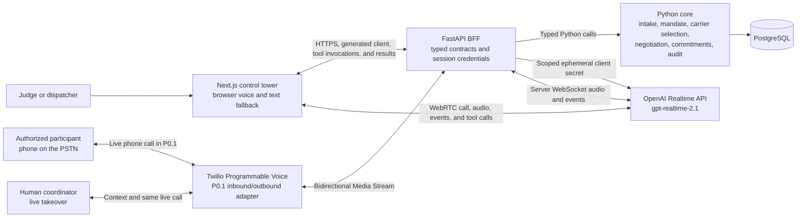

# Coordinate drayage negotiations with Volta

This decision record defines the selected Nauta challenge, the first prototype, and the evidence required for the hackathon submission. Volta coordinates ground transport through a real-time voice-agent design while keeping the reproducible P0 demo inside a browser-based simulator.

## Decision status and known gap

The team selected the drayage voice-agent case. Volta turns a coordinator's natural-language request into an approved structured mandate, selects up to three eligible carriers from a pre-registered list, negotiates with them, records candidate agreements, and updates an operation after inbound and outbound conversations.

The current P0 prototype simulates calls in the frontend. Its deterministic browser and text journey passed, and Fase 17 merged with a visible Realtime waiver: the qualitative voice checks and complete two-tool provider roundtrip remain unproved. Browser audio and text remain useful development surfaces, but the team must not present them as equivalent to telephony.

The accepted P0.1 evolution adds Twilio inbound and outbound calls over the public switched telephone network (PSTN), overlapping carrier calls, and human takeover without disconnecting the remote participant. The consent-gated outbound control and Twilio/FastAPI media bridge are implemented and merged. The control passed credential-free browser checks, but no call occurred and the live Twilio journey is not proven. The overlapping-call, inbound-recovery, and human-takeover outcomes remain final-trial work.

This decision leaves four explicit challenge gaps:

- No real inbound or outbound call over the phone network
- No written recap sent through Short Message Service (SMS) or email
- No literal overlap of three live carrier calls
- No human transfer inside a live phone call without disconnecting

The initial P0 accepts these gaps only as a temporary implementation checkpoint. P0.1 closes the telephony, literal-overlap, and live-human-handoff gaps through the outbound path followed by dedicated inbound-call and handoff phases. The team could not enable the required A2P 10DLC registration within the hackathon schedule, so real SMS delivery remains an explicit submission gap. Browser and simulated-delivery paths remain explicit fallbacks rather than substitutes for external evidence.

## Problem to solve

Ground-transport coordination still depends on phone calls. A dispatcher may quote a rate, change a pickup window, report a broken truck, or add a condition that never reaches a structured system.

These calls create four operational problems:

- Agreements remain in human memory instead of the operation record
- One unavailable person can block the shipment
- Coordinators cannot manage several negotiations at once
- Teams cannot audit why a carrier was selected or whether the agreement stayed inside its mandate

## Target user and participants

The primary user is an operations coordinator at an importer or freight forwarder. For the P0 proof of concept, this coordinator is the single human role: they submit the initial request, approve the extracted mandate, watch negotiations, resolve escalations, and audit the resulting commitments. The mandate is the structured set of approved rules, not a separate participant.

The conversation participants are carrier dispatchers, drivers, and a judge who improvises a dispatcher during the live trial. The first prototype uses team members or judges as simulated participants selected from a pre-registered carrier list, not real carriers.

## Value proposition

Volta turns messy carrier conversations into mandate-safe, auditable commitments that update the shipment operation.

### Commitment states

The challenge counts an agreement as a commitment only after the system sends a written recap and links the agreement to an audio timestamp. The plan uses three distinct states:

- `CANDIDATE`: Volta extracted an agreement that passed the mandate check
- `SIMULATED`: The prototype displayed a recap but did not send it through SMS or email
- `VERIFIED`: A delivery provider accepted the written recap and the agreement links to an exact timestamp in playable audio

The hackathon prototype stops at `SIMULATED`. It must not label or present this state as a challenge-verified commitment. A later delivery integration may promote an agreement to `VERIFIED` only after an external provider accepts its real written recap and the agreement retains playable timestamp evidence.

This evidence lifecycle is separate from the operational disposition of a commitment. A commitment is either the one `ACTIVE` selection or a historical `SUPERSEDED` selection. Replacing a carrier changes that disposition atomically without erasing the earlier evidence or recap.

## Canonical scenario

Textiles Pacífico has a container arriving at the port of Manzanillo. The container needs ground transport to the company warehouse in Guadalajara.

The coordinator starts with a natural-language request such as: "Find ground transport for Thursday from Manzanillo to Guadalajara for at most MXN 9,000." A versioned server-side prompt policy extracts an operation draft and proposes this structured mandate:

- Book pickup for Thursday
- Accept a total rate up to MXN 9,000
- Escalate any different pickup day, higher price, or conflicting condition

The coordinator must review and approve the structured operation and mandate before Volta can call anyone. The prompt policy may interpret the request, but it does not authorize an agreement: deterministic backend rules enforce the approved price, currency, pickup window, conditions, and mandate version. Editing the extraction policy through an administrative screen is a future evolution, not part of P0.

After approval, Volta filters the pre-registered carriers by route coverage and declared availability, ranks the eligible results by a fixed demo priority, and selects up to three. It proceeds with one to three eligible carriers. If none is eligible, it creates an auditable human escalation before starting any call.

English is the primary demo language. A short English interruption tests barge-in and coherent recovery. The team confirmed this language choice on 2026-08-29 after the OpenAI capability trial.

## Prototype success signal

The prototype succeeds when a coordinator can submit the request as a prompt, approve the extracted mandate, and observe Volta produce a correct operational result through the browser voice simulator. Volta may recover autonomously inside the active mandate, but it must refuse or escalate any request outside it.

The observable evidence includes:

- Automatic selection of one to three eligible carriers from a pre-registered list
- Up to three carrier negotiations managed as concurrent workflow sessions
- An auditable quote comparison and one selected winner
- No candidate agreement above MXN 9,000 or outside Thursday without human approval
- A candidate agreement linked to the `audio_start_ms` offset of the agreeing turn in a playable audio artifact
- A written recap displayed with an explicit simulated-delivery status
- A structured brief with quotes, names, conditions, objections, decisions, and changes
- A browser-simulated inbound call from the selected carrier
- A good recovery scenario that renegotiates inside the mandate or reconfirms the best viable alternative before atomically replacing the winner
- A bad recovery scenario that creates a human escalation without making an unauthorized change
- An auditable control-tower notification for every autonomous recovery
- A renegotiation after the human extends or replaces the mandate when an escalation is approved
- Barge-in handling during browser audio
- A live human takeover inside the simulator with the prior context visible

## Demo journey

The demo uses a shared setup followed by two reproducible recovery scripts.

### Shared setup and outbound negotiation

1. The coordinator describes the Textiles Pacífico transport request in a prompt.
2. Volta applies the versioned server policy and displays an operation draft plus the Thursday, MXN 9,000 structured mandate for review.
3. The coordinator approves the mandate and explicitly starts the negotiation.
4. Volta selects up to three carriers by route coverage, declared availability, and fixed priority. If none is eligible, it escalates without dialing.
5. Volta starts the selected simulated carrier negotiations close together. The sessions may overlap in workflow state, but they do not need simultaneous audio.
6. Each dispatcher quotes a rate and pickup window. At least one dispatcher contradicts an earlier statement or tries to exceed the mandate.
7. Volta records each quote, negotiates inside the mandate, compares the eligible options, and selects one winner.
8. Volta creates a candidate agreement linked to the exact agreement moment. The control tower displays the written recap, marks the result `SIMULATED`, and stores the call brief.

### Good recovery script

1. The selected carrier makes a browser-simulated inbound call and reports a problem with the agreed service.
2. Volta first tries to adjust the terms with that carrier without exceeding the approved mandate.
3. If the carrier cannot offer a viable adjustment, Volta contacts the best alternative whose quote remains valid and reconfirms its availability and terms in a new call.
4. After a mandate-safe confirmation, Volta atomically keeps the current carrier or replaces it with the alternative. The prior commitment remains in the audit history but is no longer active, so the operation never has two active winners.
5. Volta updates the operation, recap, brief, and control tower. Because the decision remains inside the approved mandate, the coordinator receives an auditable notification rather than an approval request.

### Bad escalation script

1. The selected carrier makes a browser-simulated inbound call and requests a change outside the mandate.
2. Volta verifies that the current carrier cannot recover inside the mandate and that no previously quoted alternative is viable after reconfirmation.
3. Volta preserves the current audit state, makes no replacement commitment, and creates a human escalation with the conflicting terms, attempted alternatives, conversation context, and recommended next action.
4. The coordinator may decline the change, close the operation, or approve a new mandate version. Only then may Volta resume negotiation.
5. The audit view shows the intake prompt, prompt-policy version, mandate versions, carrier-selection rationale, quotes, commitment evidence, replacements, notifications, escalation, and final decision.

## P0 scope

The first prototype includes:

- A Next.js control tower for the operation, mandate, live session, comparison, escalation, and audit trail
- Natural-language order intake with a structured operation and mandate preview that requires coordinator approval
- A versioned server-side prompt policy for extraction, with deterministic backend enforcement after approval
- A pre-registered synthetic carrier list with route coverage, declared availability, and fixed ranking priority
- Automatic selection of one to three eligible carriers, with pre-call escalation when none is eligible
- Browser voice as the primary interaction and text as a deterministic fallback
- OpenAI Realtime application programming interface (API) for low-latency speech, interruptions, conversation events, and tool calls
- `gpt-realtime-2.1` as the initial voice-agent model, subject to account access verification
- Up to three carrier sessions coordinated concurrently at the workflow level
- Backend enforcement for price, currency, pickup window, conditions, and mandate version
- Structured quotes, candidate agreements, atomic winner replacement, evidence links, recaps, call briefs, notifications, escalations, and audit events
- A private, playable demo recording with the `audio_start_ms` offset for each agreeing turn
- Two reproducible recovery scripts using simulated inbound calls: one autonomous mandate-safe recovery and one human escalation
- PostgreSQL persistence for the operation and audit state
- English voice testing with natural pacing and one English interruption

## P0.1 evolution — complete real telephony path

P0.1 upgrades outbound negotiation and inbound recovery from browser simulation to real calls over the phone network and supports human takeover of a live call. The browser experience remains a deterministic development harness and demo fallback. Written-recap delivery remains simulated for the hackathon because A2P 10DLC registration could not be enabled in time.

P0.1 includes:

- Twilio Programmable Voice as the first PSTN provider adapter
- Three overlapping outbound calls to authorized test participants acting as carrier dispatchers
- One real inbound driver or dispatcher call correlated fail-closed to the active synthetic operation
- A FastAPI server WebSocket that bridges Twilio bidirectional Media Streams to the OpenAI Realtime API
- Signed inbound voice, call-status, and handoff callbacks with provider identifiers linked to provider-neutral records
- The same deterministic backend enforcement for mandate checks, quotes, counteroffers, winner selection, and candidate agreements
- An explicit human action and destination allowlist before dialing
- AI disclosure at the beginning of each call and consent before recording
- One simulated written recap for the final active winner, visibly labeled `SIMULATED` and linked to playable timestamp evidence
- One coordinator takeover that preserves the live remote leg and structured context while preventing further AI commitments
- Browser voice, text mode, and a recorded trial as fallbacks

This list is the minimum hackathon path. Phases 26 and 28 are mandatory. They prove one bounded inbound recovery and one successful live takeover. Real written-recap delivery, production routing, exhaustive provider-failure trials, and scale beyond three authorized outbound calls remain outside the gate.

The implementation baseline is Twilio's official documentation for inbound and outbound Voice calls, Media Streams, in-progress call modification or conferencing, and the OpenAI Realtime API. The final trial requires an account that can call every authorized participant without a trial announcement or destination restriction.

Each phase specification must verify the current provider API, signatures, account restrictions, regional phone requirements, calling rules, and recording obligations before implementation. Twilio remains behind provider protocols so another voice provider can replace it without changing mandate or commitment rules.

## Explicit non-goals

The initial P0 prototype excludes:

- Real PSTN and Twilio Voice until P0.1; SMS, email, direct SIP trunking, and real-carrier integration remain excluded from the hackathon scope
- A claim that browser audio satisfies the challenge requirement for real phone calls
- A claim that a simulated recap creates a challenge-verified commitment
- Real carrier bookings, real rates, or integration with a transportation management system
- Unallowlisted inbound callers, production contact-center routing, and arbitrary public operation lookup
- A claim of parallel negotiation unless the final trial records literal overlap across the three carrier calls
- An administrative interface for editing the prompt policy; the P0 policy remains versioned server configuration
- Yuno, payments, payment credentials, or financial mutations
- Production identity verification, fraud detection, or detection of another voice agent
- Production-grade call recording consent, regional telephony compliance, retention, and deletion workflows
- Multi-tenant production authorization, billing, analytics, or high-availability infrastructure

## Architecture for P0 and P0.1

Only the call channel is simulated in the frontend. The frontend also captures the natural-language request and presents the extracted draft for approval. Prompt-based extraction runs behind the API using a versioned server policy; mandate enforcement, carrier eligibility and ranking, negotiation rules, commitment states, replacement decisions, and audit decisions remain in the Python core. The FastAPI backend for frontend (BFF) exposes typed contracts. The browser receives a short-lived Realtime credential and connects to OpenAI through Web Real-Time Communication (WebRTC).

The direct browser-to-Realtime connection is a challenge-specific exception to the repository browser boundary. FastAPI requests a scoped ephemeral client secret from OpenAI; this step does not create the active call. The browser uses that secret to establish the WebRTC call through the OpenAI `/v1/realtime/calls` interface.

Before any call, the API uses the versioned prompt policy to produce a structured draft. The coordinator's approval creates the active operation and immutable mandate version. Carrier selection then filters deterministic eligibility fields and applies the fixed priority order; the model does not choose whom to call.

During calls, the browser receives tool requests from the Realtime session and invokes typed FastAPI endpoints. After the Python core validates and executes a request, the browser sends a `conversation.item.create` event with a `function_call_output` item and the original `call_id`. It then sends `response.create` so Volta can continue with the validated result. The Python core remains the only component that can change an agreement state or active winner. The standard OpenAI API key remains server-side and never reaches the browser, logs, committed files, or screenshots.

The client-secret endpoint must enforce an authorized demo identity, allowed origins, rate limits, a narrow session configuration, and a privacy-preserving safety identifier. It must disable caching and redact credentials from logs and errors.

P0.1 uses the FastAPI server bridge for inbound and outbound calls. Twilio initiates each authorized outbound PSTN call or requests signed instructions for an inbound call, then streams audio bidirectionally to the API, which exchanges audio and events with OpenAI Realtime. A verified control action moves the same live remote call into human takeover while stopping further AI commitments. The Python core remains the only component that can validate a mandate or change an agreement state. Direct SIP and external recap delivery remain later alternatives rather than part of P0.1.

## OpenAI capabilities required

The prototype requires these Realtime capabilities:

- Server-side structured extraction of the intake prompt into a schema-validated operation and mandate draft; the implementation phase must select a model available to the account
- Low-latency speech-to-speech sessions
- WebRTC for browser audio
- Server WebSocket audio for the Twilio Media Streams bridge
- Server-issued ephemeral client credentials
- Tool calls for quotes, mandate checks, candidate agreements, recaps, briefs, and escalations
- Server voice activity detection events with `audio_start_ms` and `item_id` for agreement-turn evidence
- Interruption handling and voice activity detection that the team validates with barge-in tests
- English speech with natural pacing and interruption recovery

The official OpenAI Realtime overview currently recommends `gpt-realtime-2.1` for low-latency voice agents. It recommends WebRTC for browser audio, WebSocket for server media pipelines, and SIP for telephony agents. Start with low reasoning effort, then measure mandate accuracy and response latency under the trial scenarios.

With server voice activity detection enabled, `input_audio_buffer.speech_started` reports `audio_start_ms` and the user-message `item_id`. The prototype uses the start of the caller turn that contains the confirmed agreement as its playback link. It stores the event ID, item ID, and offset with the private recording. This is turn-level evidence, not a claim of word-level timestamp accuracy.

## Yuno capabilities required

None. The selected case belongs to the Nauta challenge and has no payment journey. Adding Yuno would increase scope without supporting the selected outcome.

## Data model changes

The backend needs a small, auditable model:

| Entity | Responsibility | Required evidence |
| --- | --- | --- |
| `IntakeDraft` | Natural-language request and extracted operation and mandate preview | Source prompt, prompt-policy version, structured extraction, validation result, and approval status |
| `Operation` | Container, route, target pickup, and current state | Current version and status history |
| `Mandate` | Price cap, currency, pickup window, conditions, and authority | Immutable version used for each decision |
| `Carrier` | Synthetic carrier identity, contact label, and selection profile | Stable identifier, route coverage, declared availability, fixed priority, and no real private contact in fixtures |
| `Negotiation` | Market comparison across up to three carrier sessions | Eligible carrier set, ranking rationale, start time, quotes, active winner, and selection history |
| `CallSession` | Browser or PSTN conversation | Channel, provider, direction, timestamps, provider call ID, Realtime reference, and terminal state |
| `Quote` | Rate, window, conditions, and validity | Source session and mandate eligibility result |
| `Commitment` | Agreed facts and `CANDIDATE`, `SIMULATED`, or `VERIFIED` evidence lifecycle | Carrier, quote, mandate version, recap status, active or superseded disposition, replacement link, and agreement evidence |
| `CommitmentEvidence` | Link from an agreement to the caller turn that confirms it | Call session, playable audio reference, `audio_start_ms`, item ID, and event ID |
| `WrittenRecap` | Human-readable agreement summary | Channel `simulated`, content hash, and simulated display time |
| `CallBrief` | Actions and relevant mentions from the conversation | Structured facts, objections, changes, and unresolved items |
| `CoordinatorNotification` | Auditable notice for an autonomous mandate-safe recovery | Operation version, before-and-after decision, reason, and acknowledgement state |
| `Escalation` | Context for human takeover | Trigger, mandate conflict, context package, and resolution |
| `AuditEvent` | Append-only operational history | Actor, event type, timestamp, correlation ID, and safe metadata |

Use synthetic names, numbers, and rates. Do not store secrets, authentication headers, or unrelated personal data. Store demo audio outside Git in private storage, disclose recording to every participant, and delete the recording after the agreed demo retention period. Evidence without playable audio and an `audio_start_ms` offset fails the timestamp gate.

## Proposed API endpoints

The FastAPI boundary will version application routes under `/v1`:

| Method and route | Purpose |
| --- | --- |
| `POST /v1/operation-drafts` | Interpret a natural-language request with the active server policy and return a structured operation and mandate preview |
| `POST /v1/operations` | Approve an intake draft and create the operation plus its initial immutable mandate |
| `GET /v1/operations/{operation_id}` | Read operation, mandate, and current negotiation state |
| `POST /v1/operations/{operation_id}/negotiations` | Select up to three eligible carriers and start their concurrent workflow sessions, or escalate when none is eligible |
| `POST /v1/realtime/client-secrets` | Authorize the demo client and mint a scoped, short-lived Realtime credential |
| `POST /v1/operations/{operation_id}/outbound-calls` | Start an authorized P0.1 PSTN negotiation through the telephony adapter |
| `POST /v1/telephony/twilio/inbound` | Verify an inbound voice request, correlate one authorized operation, and return bounded TwiML |
| `POST /v1/telephony/twilio/status` | Receive and verify Twilio call-status events before typed delegation |
| `POST /v1/calls/{call_id}/quotes` | Record and validate a quoted rate and pickup window |
| `POST /v1/calls/{call_id}/commitments` | Create a `CANDIDATE` agreement after deterministic mandate validation |
| `POST /v1/calls/{call_id}/recaps` | Create an idempotent written recap with explicit simulated-delivery state |
| `POST /v1/calls/{call_id}/briefs` | Persist the structured call brief |
| `POST /v1/calls/{call_id}/escalations` | Start a human takeover with the current context |
| `POST /v1/calls/{call_id}/handoffs` | Authorize the coordinator to join the same live call and stop further AI commitments |
| `POST /v1/operations/{operation_id}/inbound-simulations` | Trigger the good or bad browser-based recovery script from the selected carrier |
| `GET /v1/operations/{operation_id}/audit` | Return the auditable timeline and quote comparison |

These routes are proposed boundaries, not final contracts. The phase specification must define request, response, status, error, authorization, and idempotency semantics before implementation.

## Required hackathon deliverables

The submission must contain five artifacts:

1. **Presentation**: Explain the phone-process problem, mandate model, demo story, architecture, known gap, and evidence.
2. **Demo**: Run three overlapping outbound PSTN negotiations, one mandate-safe inbound recovery, and one live human takeover. Show the final winner's recap explicitly labeled `SIMULATED`, playable timestamp evidence, and structured brief, and keep browser voice plus video fallbacks ready.
3. **Public GitHub repository**: Add a README with setup, architecture, demo steps, test data, security notes, and known limitations. Remove secrets and private participant data before publication.
4. **Architecture diagram**: Refine the diagram in this decision record and distinguish the P0 browser harness from the P0.1 Twilio path.
5. **Decision log**: Preserve the alternatives below and add later decisions as they occur.

## Initial decision log

| Decision | Selected option | Alternatives considered | Why this option | Consequence |
| --- | --- | --- | --- | --- |
| Challenge case | Volta drayage voice agent, provisionally | Other announced cases | It demonstrates realtime voice, bounded autonomy, tool use, and auditable state in one story | The team may switch cases after the feasibility checkpoint |
| Intake and mandate | Natural-language request, structured extraction, and explicit coordinator approval | Fixed structured form; prompt-only authority | It makes the demo natural without allowing model text to become operational authority | The API must expose a draft and approval boundary |
| Prompt policy | Versioned server configuration for P0 | Administrative editor; per-request free-form policy | It keeps the proof of concept controlled and reproducible | A policy-editing interface remains a documented future evolution |
| Carrier selection | Deterministic eligibility filter and fixed priority over a pre-registered list | Manual selection; model-selected carriers | It demonstrates automation without making dialing targets nondeterministic | No eligible carrier creates an escalation before any call |
| Call channel | P0 browser harness followed by P0.1 Twilio inbound and outbound PSTN | Browser-only submission; direct SIP; another telephony provider | Twilio documents inbound webhooks, outbound Voice, Media Streams, live-call updates, and OpenAI Realtime bridging | The final trial requires credentials, authorized participants, public signed ingress, and current compliance checks |
| Carrier parallelism | Three overlapping real outbound calls in the final trial | Workflow-only overlap; three sequential calls | It directly proves the challenge's market-negotiation requirement | The account, bridge, and application must sustain three independent live sessions safely |
| Realtime transport | WebRTC for P0 browser audio and a FastAPI WebSocket bridge for P0.1 Twilio calls | Direct SIP; provider-managed voice-agent platform | Both channels reuse the same backend tools and mandate enforcement | The bridge must be tested under interruption and disconnects |
| Voice model | `gpt-realtime-2.1` | Another Realtime model available to the account; text-only model | It is the current model recommended in the official Realtime voice-agent overview | Account access and limits must be checked before implementation |
| Written recap | Remain simulated during the hackathon | Add SMS now; support SMS and email initially | A2P 10DLC registration could not be enabled within the schedule, so telephony and handoff take priority | The demo labels the recap `SIMULATED`; `VERIFIED` remains unreachable without accepted external delivery |
| Recovery autonomy | Renegotiate with the winner, then reconfirm the best valid alternative | Always require approval; switch without reconfirmation | It shows bounded autonomy while preventing stale quotes from becoming commitments | Mandate-safe changes notify the coordinator; conflicts or no viable option escalate |
| Recovery demo | Reproducible browser scripts followed by one authorized real inbound PSTN trial | Browser-only inbound; one improvised branch | Deterministic scripts preserve diagnosis while the real call proves the required channel | Inbound correlation must fail closed before exposing or changing an operation |
| Human takeover | Join the coordinator to one live call with structured context and stop further AI commitments | Hang up and call back; simulator-only takeover | It satisfies the explicit no-disconnect escalation requirement without moving mandate authority into the provider | One successful sandbox handoff plus focused failure tests completes the dedicated vertical phase |
| Payments | No Yuno integration | Add a payment step | Payments do not support the selected Nauta outcome | The existing payment adapter remains unused |
| Demo format | Live outbound PSTN call with browser and recorded fallbacks | Browser-only trial; video-only demo | It demonstrates the real-phone requirement and preserves deterministic recovery paths | The team must provision and test Twilio before the final trial |

## Main risks and mitigations

| Risk | Impact | Mitigation or decision gate |
| --- | --- | --- |
| Twilio provisioning, destination restrictions, or phone-number requirements block P0.1 | Critical scoring gap | Provision early, use authorized test numbers, verify account limits, and retain browser plus recorded fallbacks |
| A simulated recap appears to verify an agreement | Misleading audit evidence | Keep explicit states and reserve `VERIFIED` for accepted external delivery |
| Prompt extraction omits or invents a constraint | Calls start under the wrong authority | Validate the structured draft, show the source and policy version, and require coordinator approval before dialing |
| Carrier selection finds no eligible option | The workflow stalls or dials an unsuitable participant | Escalate before dialing and record failed eligibility reasons |
| A dispatcher persuades the model to exceed the mandate | Invalid or unsafe commitment | Enforce the mandate in deterministic backend code and reject invalid tool calls |
| Concurrent sessions or recovery create multiple winners | Conflicting commitments | Use one atomic active-winner transition, retain superseded commitments, and make commitment operations idempotent |
| A backup quote is stale when the winner fails | Invalid recovery commitment | Require a new call that reconfirms availability and terms before replacement |
| Spoken facts diverge from persisted state | Unreliable operation record | Read current state before tool actions and append correlation IDs to the audit trail |
| Commitment timestamps cannot be reproduced | Weak audit evidence | Retain private playable audio and test `audio_start_ms` links for agreement turns |
| Attackers mint Realtime credentials from the public demo | Cost, abuse, or data exposure | Require demo authorization, origin checks, rate limits, scoped sessions, and redacted logs |
| Browser audio, PSTN media, network, or account access fails | Demo interruption | Keep text mode, browser voice, and a recorded video that use the same backend contracts |
| A call is placed without authority or required disclosure | Trust, legal, or provider-policy failure | Allowlist destinations, require an explicit human start action, disclose AI use, and obtain consent before recording |
| An inbound caller is correlated to the wrong operation | Unauthorized disclosure or mutation | Require an allowlisted participant and fail-closed server-owned correlation to exactly one active synthetic operation |
| Human takeover disconnects the participant or leaves the AI committing | Failed escalation or conflicting authority | Prove one successful live handoff, test timeout and duplicate actions locally, and disable AI commitment tools atomically at handoff |
| English speech, noise, accents, or interruptions reduce accuracy | Failed trial by fire | Test a fixed adversarial matrix and escalate when confidence or facts are insufficient |
| Audio or names leak through the public repository | Privacy or security incident | Use synthetic participants, obtain recording consent, redact logs, and exclude artifacts from Git |
| The team changes cases late | Lost implementation time | Keep the core mandate, commitment, audit, and tool contracts provider-neutral |

## Fallback and case checkpoint

The primary P0.1 demo uses Twilio inbound and outbound Voice plus live human takeover through the FastAPI media bridge and provider adapters. Browser voice and text exercise the same tool contracts when telephony or browser audio fails. The browser also preserves deterministic good and bad inbound recovery scripts and simulated recap state. A short recording covers the full operation when the live environment fails, but neither the simulated recap nor the other fallbacks are reported as real-channel evidence.

The case checkpoint selected the real-phone challenge path as the P0.1 evolution while explicitly deferring external written-recap delivery. Implementation may invest in the narrow Twilio Voice and live-handoff boundaries defined here. Direct SIP, production recording infrastructure, real-carrier dialing, external delivery providers, and additional provider integrations remain outside scope until a later explicit decision.

## Sources

- The challenge case text supplied by the organizers through the team brief
- [OpenAI Realtime and audio documentation](https://developers.openai.com/api/docs/guides/realtime), consulted for the current voice-agent model and transport guidance
- [OpenAI Realtime conversation documentation](https://developers.openai.com/api/docs/guides/realtime-conversations), consulted for the function-call result roundtrip
- [OpenAI Realtime server events reference](https://developers.openai.com/api/reference/resources/realtime/server-events), consulted for `audio_start_ms` and agreement-turn correlation
- [Twilio Media Streams documentation](https://www.twilio.com/docs/voice/media-streams), consulted for bidirectional live-call audio over WebSockets
- [Twilio Voice webhooks documentation](https://www.twilio.com/docs/usage/webhooks/voice-webhooks), consulted for signed inbound call handling and TwiML responses
- [Twilio Call resource documentation](https://www.twilio.com/docs/voice/api/call-resource), consulted for modifying an in-progress call during handoff
- [Twilio Conference documentation](https://www.twilio.com/docs/voice/twiml/conference), consulted for preserving a live remote leg while another participant joins
- [Twilio A2P 10DLC documentation](https://www.twilio.com/docs/messaging/compliance/a2p-10dlc), consulted when the required registration could not be enabled within the hackathon schedule and SMS was deferred
- [Twilio outbound calls with Python, FastAPI, and OpenAI Realtime](https://www.twilio.com/en-us/blog/outbound-calls-python-openai-realtime-api-voice), selected as the P0.1 implementation baseline
- [Twilio trial account documentation](https://www.twilio.com/docs/usage/tutorials/how-to-use-your-free-trial-account), consulted for verified-destination and trial-account constraints
